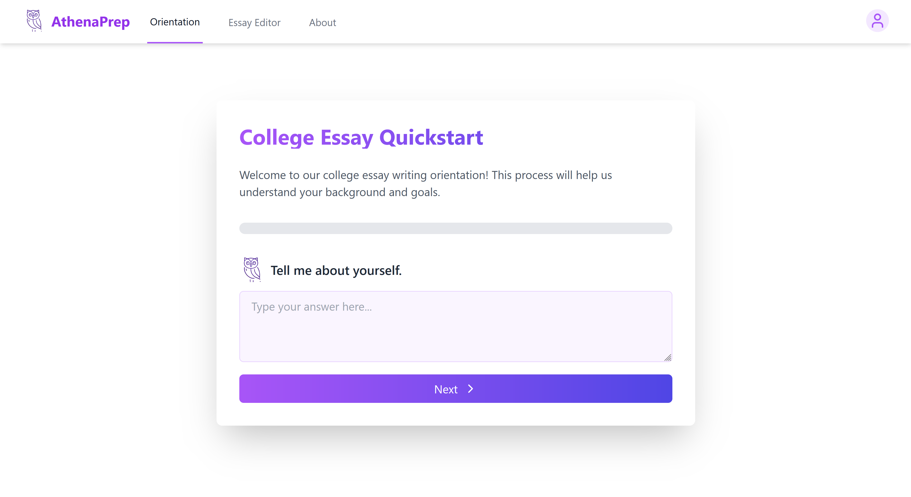

# AthenaPrep

## Overview
AthenaPrep is an AI-driven platform designed to help students with college admissions by providing affordable, personalized guidance on essays and applications. Created by a group of students at HackHarvard 2024, AthenaPrep aims to level the playing field by offering high-quality college prep resources that are accessible to everyone.

## Key Features
- **Interactive Orientation**: AthenaPrep engages students in a guided Q&A process, helping them refine their college options and application strategies. Acting as a virtual counselor, the platform ensures students are supported throughout their journey.
  
- **Essay Feedback**: Input your college essay into AthenaPrep to receive detailed, AI-driven feedback on both the overall structure and specific sections. Our platform doesn’t write the essay for you but helps you craft a compelling narrative that will catch the attention of admissions officers.

## Technology Stack
- **Frontend**: React, TailwindCSS, Vite
- **Backend**: OpenAI, Flask, Python, Gunicorn
- **AI/ML Integration**: We use OpenAI's 4o to power our essay feedback and interactive orientation features.

## Getting Started

### Prerequisites
- Node.js (v14+)
- npm or yarn
- Python 3.8+

### Frontend Installation
1. Clone the repo:
   ```bash
   git clone https://github.com/yourusername/athenaprep.git
   cd athenaprep
   ```

2. Install dependencies:
   ```bash
   npm install
   ```

3. Start the development server:
   ```bash
   npm run dev
   ```

4. Open your browser at `http://localhost:3000` to access AthenaPrep.


## Setting Up the Backend Environment

1. **Navigate to the Backend Directory**  
   First, ensure you're in the `/backend/` directory of the project:
   ```bash
   cd backend
   ```

2. **Create a Virtual Environment**  
   Create a new virtual environment by running the following command:
   - For Windows:
     ```bash
     python -m venv venv
     ```
   - For macOS/Linux:
     ```bash
     python3 -m venv venv
     ```

3. **Activate the Virtual Environment**
   - For Windows:
     ```bash
     venv\Scripts\activate
     ```
   - For macOS/Linux:
     ```bash
     source venv/bin/activate
     ```

4. **Install Dependencies**  
   Once the virtual environment is activated, install the necessary dependencies using the `requirements.txt` file:
   ```bash
   pip install -r requirements.txt
   ```

5. **Run the Backend**
   After installing dependencies, you can run the backend server (modify this step depending on your setup):
   ```bash
   python app.py
   ```

6. **Deactivate the Virtual Environment (when finished)**  
   When you're done working, deactivate the virtual environment by running:
   ```bash
   deactivate
   ```
### Usage
- Navigate to the **About** page to learn more about AthenaPrep’s mission and features.
- Use the **Essay Feedback** tool by inputting your essay to receive comprehensive feedback.
- Explore the **Interactive Orientation** to refine your college selection and application strategy.
